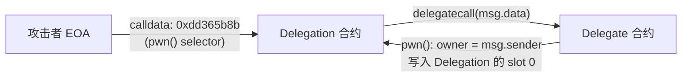

# Token Security Assessment

## 1. 审计摘要

- **项目**: `Ethernaut Delegation (Level 6)`
- **源码**: [Delegation.sol](https://github.com/OpenZeppelin/ethernaut/blob/master/contracts/src/levels/Delegation.sol)
- **链**: EVM (Solidity ^0.8.0)
- **评分**: 8/100 (D)
- **审计时间**: 2026-03-14

### 关键发现

1. `Delegation.fallback()` 中存在 **CRITICAL** 级别的 controlled-delegatecall 漏洞，攻击者可通过调用 `pwn()` 函数选择器在单笔交易中劫持合约所有权。
2. `Delegate` 和 `Delegation` 两个合约的 `owner` 变量位于同一存储槽 (slot 0)，delegatecall 上下文切换导致存储碰撞。
3. 合约无任何访问控制机制，fallback 函数完全对外开放。

### 安全亮点

- 使用 Solidity ^0.8.0，内置算术溢出保护。
- 合约逻辑简洁，无外部依赖。

### 主要风险

1. **所有权劫持 (CRITICAL)** — 任何人调用 `Delegation` 并传入 `pwn()` 的 4 字节选择器即可成为 owner。
2. **无访问控制 (HIGH)** — fallback 函数无任何调用者限制。
3. **无事件日志 (MEDIUM)** — 所有权变更不可追踪。

---

## 2. 项目概述

| 维度 | 内容 |
| --- | --- |
| 项目名称 | Ethernaut — Delegation (Level 6) |
| 合约文件 | `Delegation.sol` |
| 链 | EVM (Solidity ^0.8.0) |
| GitHub | https://github.com/OpenZeppelin/ethernaut |
| 项目性质 | OpenZeppelin 智能合约安全教学 CTF |
| 合约数量 | 2 (`Delegate`, `Delegation`) |
| 代码行数 | 31 行 |
| 许可证 | MIT |

## 3. 生态架构与资金流向

**调用链说明**:

1. 攻击者向 `Delegation` 发送交易，calldata 为 `pwn()` 的函数选择器 `0xdd365b8b`
2. `Delegation` 无匹配函数 → 触发 `fallback()`
3. `fallback()` 执行 `delegate.delegatecall(msg.data)`
4. 在 `Delegation` 的存储上下文中执行 `Delegate.pwn()`
5. `owner = msg.sender` 写入 `Delegation` 的 storage slot 0
6. 攻击者成为 `Delegation.owner`

## 4. 合约/程序安全评估

> AI 代码审查结论。基于源码分析、Slither 和 Pattern Scanner 交叉验证。

### 4.1 合约概览

文件 `Delegation.sol` 包含两个合约：

**Delegate 合约** (第 4-14 行):
- 状态变量: `address public owner` (slot 0)
- 构造函数接收 `_owner` 参数并赋值给 `owner`
- `pwn()` 函数: 无访问控制，将 `owner` 设为 `msg.sender`

**Delegation 合约** (第 16-31 行):
- 状态变量: `address public owner` (slot 0), `Delegate delegate` (slot 1)
- 构造函数设置 `delegate` 实例和 `owner`
- `fallback()` 函数: 将完整 `msg.data` 通过 `delegatecall` 转发给 `delegate`

### 4.2 设计模式与继承关系

| 模式 | 使用情况 | 安全评估 |
| --- | --- | --- |
| Delegatecall 代理 | 已使用 | **危险** — 无函数选择器白名单，允许任意函数调用 |
| Ownable | 未使用 | 缺少标准所有权管理模式 |
| Access Control | 未使用 | fallback 完全开放 |
| Events | 未使用 | 状态变更不可监控 |
| Checks-Effects-Interactions | N/A | 无外部转账调用 |
| Proxy Pattern (EIP-1967) | 未使用 | 未遵循标准代理模式，存储布局人工对齐 |

**继承关系**: 两个合约均无继承，为独立合约。`Delegation` 通过组合模式持有 `Delegate` 实例引用。

### 4.3 核心函数分析

| 函数 | 访问控制 | 风险等级 | AI 评估 |
| --- | --- | --- | --- |
| `Delegate.constructor(address)` | 部署时 | 低 | 未校验零地址，但仅影响初始化 |
| `Delegate.pwn()` | **无** | **CRITICAL** | 任何人可调用，直接覆写 owner；在 delegatecall 上下文中影响调用方存储 |
| `Delegation.constructor(address)` | 部署时 | 低 | 正常初始化逻辑 |
| `Delegation.fallback()` | **无** | **CRITICAL** | 将 msg.data 完整传递给 delegatecall，无过滤、无访问控制 |

### 4.4 Owner 特权函数

合约中 **无显式的 Owner 特权函数**。`owner` 仅作为公共状态变量存在，未绑定任何权限逻辑（如 modifier `onlyOwner`）。

风险在于：如果此合约被更大系统引用或继承，被劫持的 `owner` 可能获得上层合约的管理权限。

## 5. 静态分析结果

> AI 对扫描器 High/Medium 发现的误报研判。

### Slither 发现 (7 项)

| 编号 | 检测器 | 位置 | AI 研判 | 理由 | 实际风险 |
| --- | --- | --- | --- | --- | --- |
| S-1 | `controlled-delegatecall` | Delegation.sol:25-30 | **真阳性** | `fallback()` 将 `msg.data` 直接传递给 `delegatecall`，攻击者可指定任意函数选择器在 Delegation 存储上下文中执行 | **CRITICAL** |
| S-2 | `missing-zero-check` | Delegation.sol:7-8 | **真阳性** | `Delegate.constructor` 未校验 `_owner` 参数是否为零地址 | 低 |
| S-3 | `solc-version` | Delegation.sol:2 | **真阳性** | `^0.8.0` 约束过宽，允许使用包含 FullInlinerNonExpressionSplitArgumentEvaluationOrder 等已知 bug 的编译器版本 | 低 |
| S-4 | `low-level-calls` | Delegation.sol:26 | **真阳性** | delegatecall 为底层调用，需谨慎使用 | INFO |
| S-5 | `redundant-statements` | Delegation.sol:28 | **真阳性** | `this;` 是无操作表达式，浪费 gas 且降低可读性 | INFO |
| S-6 | `immutable-states` (delegate) | Delegation.sol:18 | **真阳性** | `delegate` 仅在构造函数赋值，可声明为 immutable 节省 gas | INFO |
| S-7 | `immutable-states` (owner) | Delegation.sol:17 | **误报** | `Delegation.owner` 在正常代码路径中仅构造函数赋值，但 delegatecall 执行 `pwn()` 会修改 slot 0（即 owner），因此不能声明为 immutable | N/A |

### Pattern Scanner 发现 (2 项)

| 编号 | 检测器 | 位置 | AI 研判 | 理由 | 实际风险 |
| --- | --- | --- | --- | --- | --- |
| P-1 | 重入攻击风险 | Delegation.sol:12 | **误报** | `pwn()` 函数仅包含 `owner = msg.sender`，无外部调用，不存在重入路径 | N/A |
| P-2 | delegatecall 使用 | Delegation.sol:26 | **真阳性** | delegatecall 目标地址虽不可控（固定为 `delegate`），但 calldata 完全可控，允许调用 Delegate 上的任意函数 | **CRITICAL** |

### 扫描器结果统计

| 类别 | 数量 |
| --- | --- |
| 真阳性 | 7 |
| 误报 | 2 |
| 总计 | 9 |

## 6. GoPlus 安全检测结果

> 本次审计为纯源码审计，无已部署合约地址，GoPlus API 不可用。

N/A — 合约未部署上链。

## 7. 链上数据分析

> 本次审计为纯源码审计，无链上部署实例。

N/A — 无 RPC 数据。

## 8. 代币经济模型分析

N/A — 该合约非代币合约，不涉及代币经济模型。`Delegation.sol` 为 Ethernaut 安全教学 CTF 关卡合约，仅包含所有权管理逻辑。

## 9. 治理架构分析

| 维度 | 内容 |
| --- | --- |
| Owner 模式 | 非标准 — 无 Ownable 继承，owner 为裸状态变量 |
| 多签 | 无 |
| Timelock | 无 |
| 权限层级 | 无 — owner 变量未绑定任何权限检查 |
| 所有权变更保护 | **无** — 通过 delegatecall 可被任何人覆写 |

治理架构完全缺失，合约不具备生产级治理能力。

## 10. 桥/Vault/跨链风险

N/A — 合约不涉及跨链、桥接或 Vault 功能。

## 11. 第三方依赖风险

| 依赖 | 评估 |
| --- | --- |
| 外部合约导入 | 无 — 合约未 import 任何外部库或接口 |
| 编译器依赖 | `pragma solidity ^0.8.0` — 约束过宽 |
| OpenZeppelin 库 | 未使用 — 虽为 OpenZeppelin 项目，但该合约未引用其标准库 |
| Oracle | 无 |
| DEX Router | 无 |

合约无外部依赖，第三方风险为零。

## 12. 风险矩阵

| 风险项 | 可能性 | 严重程度 | 综合风险 |
| --- | --- | --- | --- |
| delegatecall 所有权劫持 | **极高** | **极高** | **CRITICAL** |
| 无访问控制 (fallback 开放) | 极高 | 高 | **HIGH** |
| 无事件日志 | 高 | 中 | **MEDIUM** |
| 零地址校验缺失 | 低 | 低 | **LOW** |
| 编译器版本约束过宽 | 低 | 低 | **LOW** |
| 冗余代码 (`this;`) | 低 | 最低 | **INFO** |

## 13. 建议与缓解措施

1. **禁止生产部署**: 该合约为 CTF 教学用途，包含故意设置的安全漏洞，**严禁**用于任何生产环境。

2. **添加访问控制** (如需参考修复方案):
   - 为 `fallback()` 添加 `onlyOwner` modifier
   - 或实现函数选择器白名单，限制可通过 delegatecall 执行的函数

3. **标准代理模式**: 如需实现代理合约，应使用 EIP-1967 Transparent Proxy 或 UUPS 模式，避免存储槽碰撞和任意函数调用。

4. **移除 `pwn()` 函数**: `pwn()` 为无访问控制的所有权变更函数，在任何合约设计中都不应存在。

5. **添加事件**: 所有状态变更（尤其是所有权变更）应发出事件以支持链上监控。

6. **锁定编译器版本**: 将 `pragma solidity ^0.8.0` 替换为固定版本（如 `pragma solidity 0.8.24`）。

7. **零地址校验**: 在构造函数中添加 `require(_owner != address(0))` 和 `require(_delegateAddress != address(0))`。
