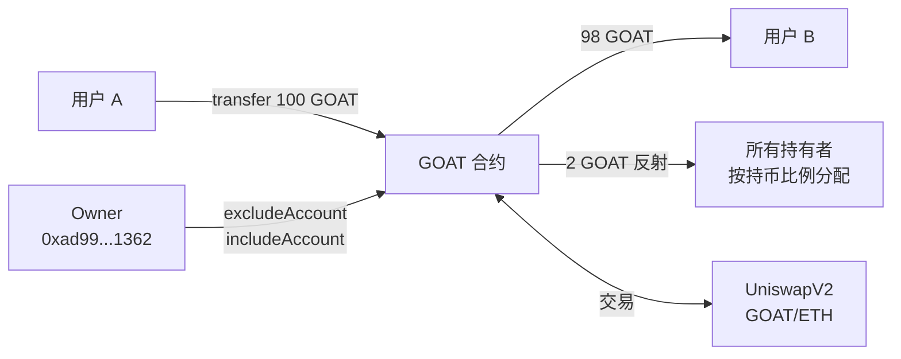

# Token Security Assessment

## 1. 审计摘要

- **项目**: `GOAT Coin (GOAT)`
- **合约地址**: `0x37611b28aca5673744161dc337128cfdd2657f69`
- **链**: Ethereum Mainnet
- **评分**: 92/100 (S)
- **部署时间**: 2021-03-19
- **审计时间**: 2026-03-13

### 关键发现

1. 合约为标准 RFI (Reflect Finance) 克隆，2% 转账费通过反射机制自动分配给持有者。
2. 所有 GoPlus 安全检测项均通过，无致命风险标签。
3. 合约不可增发、不可暂停、无代理升级、无黑名单、无自毁。
4. Owner 未放弃所有权，但特权函数风险有限（仅 exclude/include 账户）。

### 安全亮点

- 税率 2% 硬编码在 `_getTValues` 函数中，Owner 无法修改。
- 供应量固定在构造函数中（100,000,000 GOAT），无铸币函数。
- 无外部调用、无 delegatecall、无 selfdestruct。
- 使用 OpenZeppelin SafeMath 和 Address 库，防溢出保护完备（Solidity 0.6.12）。

### 主要风险

1. **LP 未锁定** — 99.99% LP 由单一 EOA 持有且未锁仓。
2. **流动性极低** — 仅 ~23 ETH UniswapV2 流动性。
3. **Owner 未放弃** — 保留 `excludeAccount`/`includeAccount` 控制权。
4. **持仓集中** — Top 10 持有 59.32%，前两大地址持有 34.78%。

---

## 2. 项目概述

| 维度 | 内容 |
| --- | --- |
| 项目名称 | GOAT Coin |
| Token 符号 | GOAT |
| 合约地址 | `0x37611b28aca5673744161dc337128cfdd2657f69` |
| 链 | Ethereum Mainnet |
| GitHub | 未提供 |
| 官网 | https://goatcoin.net |
| 文档 | 未提供 |
| Token 标准 | ERC-20（自定义转账逻辑） |
| 总供应量 | 100,000,000 GOAT |
| 精度 | 9 Decimals |
| 编译器 | Solidity v0.6.12+commit.27d51765 |
| 优化 | Yes, 200 runs |
| 许可证 | MIT |

**项目描述**（来自 Etherscan）: GOAT Coin 对每笔转账收取 2% 交易费，并按持有者的持币比例自动分配给所有持有者。

## 3. 生态架构与资金流向



资金流向简述：
- 每笔 GOAT 转账扣除 2% 费用，通过反射机制按比例分配给所有未被排除的持有者。
- 唯一 DEX 流动性在 UniswapV2 GOAT/ETH 交易对。
- Owner 可控制哪些地址被排除出反射分红。

## 4. 合约/程序安全评估

> AI 代码审查结论。基于 Etherscan 已验证源码分析。

### 4.1 合约概览

GOAT 合约继承自 `Context`、`IERC20` 和 `Ownable`，是典型的 **Reflect Finance (RFI)** 克隆合约。

**继承关系**:
```
Context (abstract)
├── Ownable
└── GOAT (is Context, IERC20, Ownable)
```

**依赖库**:
- `SafeMath` — uint256 安全算术（add/sub/mul/div/mod）
- `Address` — 地址工具（isContract、sendValue、functionCall）

**核心状态变量**:

| 变量 | 类型 | 说明 |
| --- | --- | --- |
| `_rOwned` | mapping(address => uint256) | 反射空间余额 |
| `_tOwned` | mapping(address => uint256) | 代币空间余额（仅排除账户） |
| `_isExcluded` | mapping(address => bool) | 是否被排除出反射 |
| `_excluded` | address[] | 排除地址列表 |
| `_tTotal` | uint256 (constant) | 总供应量 100M * 10^9 |
| `_rTotal` | uint256 | 反射总量 (MAX - MAX%_tTotal) |
| `_tFeeTotal` | uint256 | 累计费用总量 |

### 4.2 设计模式与继承关系

**RFI (Reflect Finance) 模式**:
- 使用双重记账系统：`_rOwned`（反射空间）和 `_tOwned`（代币空间）
- 反射空间通过不断缩减 `_rTotal` 来增加所有持有者的实际余额
- 被排除的账户使用 `_tOwned` 直接记录余额，不参与反射
- 费率固定 2%，在 `_getTValues` 中硬编码

**Ownable 模式**:
- 标准 OpenZeppelin Ownable，单一 Owner
- 支持 `renounceOwnership` 和 `transferOwnership`

**已识别安全特征**:
- 无代理模式（非 Proxy/Upgradeable）
- 无外部依赖合约调用
- 无 delegatecall
- 无工厂模式
- 无时间锁

### 4.3 核心函数分析

| 函数 | 访问控制 | 风险等级 | AI 评估 |
| --- | --- | --- | --- |
| `transfer` | public | 低 | 标准 ERC-20 + RFI 反射逻辑，经 `_transfer` 分发 |
| `transferFrom` | public | 低 | 标准授权转账 + SafeMath 溢出保护 |
| `approve` | public | 低 | 标准 ERC-20 approve |
| `reflect` | public | 低 | 持有者自愿销毁反射份额，仅限非排除账户 |
| `excludeAccount` | onlyOwner | 中 | Owner 可排除地址出反射分红 |
| `includeAccount` | onlyOwner | 低 | Owner 恢复地址参与反射 |
| `renounceOwnership` | onlyOwner | - | 可放弃所有权（尚未调用） |
| `transferOwnership` | onlyOwner | 低 | 可转移所有权 |

**`_transfer` 内部逻辑**: 根据发送方和接收方的排除状态，路由到四种转账路径之一：
1. `_transferStandard` — 双方均未排除
2. `_transferToExcluded` — 接收方已排除
3. `_transferFromExcluded` — 发送方已排除
4. `_transferBothExcluded` — 双方均已排除

每种路径均正确处理反射空间和代币空间的余额更新，并调用 `_reflectFee` 将 2% 费用从 `_rTotal` 中扣除。

### 4.4 Owner 特权函数

**`excludeAccount(address)`**:
- 将目标地址标记为"排除"，从此不再被动获得反射分红
- 将其 `_rOwned` 转换为 `_tOwned` 确保余额一致
- 该地址加入 `_excluded` 数组
- **风险分析**: Owner 可将任意地址排除出分红。常见合法用途是排除 DEX 交易对和合约地址。恶意使用场景是将特定用户排除以剥夺其分红权益，但无法直接窃取资金。

**`includeAccount(address)`**:
- 从排除列表中移除地址，恢复反射分红
- 使用数组末尾元素覆盖后 pop 的标准模式
- **风险分析**: 低风险，仅恢复功能。

## 5. 静态分析结果

> Slither v0.10+ (solc 0.6.12) 扫描 16 项发现 + Pattern Scanner 1 项 HIGH。AI 逐条研判如下。

### Slither 扫描结果

| 编号 | 检测器 | 位置 | 级别 | AI 研判 | 理由 | 实际风险 |
| --- | --- | --- | --- | --- | --- | --- |
| S-1 | shadowing-local | `allowance()` 参数 `owner`、`_approve()` 参数 `owner` | Low | 真阳性 | 参数名 `owner` 遮蔽 `Ownable.owner()` 函数。不影响功能——函数内通过参数访问，未调用 `owner()` | Info |
| S-2 | assembly | `Address.isContract`、`Address._functionCallWithValue` | Info | 误报 | OpenZeppelin Address 库标准实现，合约业务逻辑未使用这些函数 | 无 |
| S-3 | costly-loop | `includeAccount` 中 `_excluded.pop()` | Info | 真阳性 | 循环内执行存储删除操作。实际影响极小，仅 Owner 可调用且排除列表通常很短 | Low |
| S-4 | dead-code | `Context._msgData()` | Info | 真阳性 | 从未调用但不影响安全 | Info |
| S-5 | solc-version | `pragma solidity ^0.6.0` | Info | 真阳性 | 编译器较旧，存在已知 bug 列表。但合约使用 SafeMath 且逻辑简单，标注的 bug 均不影响此合约 | Low |
| S-6 | low-level-calls | `Address.sendValue`、`Address._functionCallWithValue` | Info | 误报 | Address 库的标准实现，合约未调用这些函数 | 无 |
| S-7 | naming-convention | `_tTotal` 未使用大写 | Info | 真阳性 | 编码规范问题，不影响安全 | Info |
| S-8 | redundant-statements | `Context` 中的 `this` | Info | 真阳性 | OpenZeppelin Context 标准写法，消除编译器警告用 | Info |
| S-9 | cache-array-length | `_getCurrentSupply` 循环 `_excluded.length` | Gas | 真阳性 | 每次循环重读存储中的数组长度，浪费 Gas。排除列表短时影响极小 | Info |
| S-10 | constable-states | `_name`、`_symbol`、`_decimals` | Gas | 真阳性 | 可声明为 constant 节省 Gas，不影响安全 | Info |

### Pattern Scanner 扫描结果

| 编号 | 检测器 | 位置 | 级别 | AI 研判 | 理由 | 实际风险 |
| --- | --- | --- | --- | --- | --- | --- |
| P-1 | Solidity <0.8 无溢出保护 | GOAT.sol:1 | HIGH | **误报** | 合约全量使用 `SafeMath` 库（`using SafeMath for uint256`），所有算术运算均通过 `add/sub/mul/div` 包裹，溢出保护完备 | 无 |

### AI 审查结论

- **High/Critical 真阳性**: 0 项
- **Low 真阳性**: 2 项（S-3 costly-loop、S-5 solc-version）
- **误报**: 3 项（S-2 assembly、S-6 low-level-calls、P-1 溢出保护）
- **Info**: 5 项（编码规范、Gas 优化）
- **总体评估**: Slither 和 Pattern Scanner 均未发现 High/Critical 级别的真阳性安全问题。合约逻辑简单且安全。

## 6. GoPlus 安全检测结果

| 检查项 | GoPlus 结果 | 判定 | 风险等级 |
| --- | --- | --- | --- |
| 蜜罐 (Honeypot) | is_honeypot=0 | PASS | - |
| 可增发 (Mintable) | is_mintable=0 | PASS | - |
| 代理/可升级 (Proxy) | is_proxy=0 | PASS | - |
| 暂停转账 (Pausable) | transfer_pausable=0 | PASS | - |
| 黑名单 (Blacklist) | is_blacklisted=0 | PASS | - |
| 隐藏 Owner | hidden_owner=0 | PASS | - |
| 自毁 (Selfdestruct) | selfdestruct=0 | PASS | - |
| 外部调用 | external_call=0 | PASS | - |
| 可夺回所有权 | can_take_back_ownership=0 | PASS | - |
| Owner 可改余额 | owner_change_balance=0 | PASS | - |
| 源码已验证 | is_open_source=1 | PASS | - |
| 无法买入 | cannot_buy=0 | PASS | - |
| 无法全部卖出 | cannot_sell_all=0 | PASS | - |
| 滑点可修改 | slippage_modifiable=0 | PASS | - |
| 创建者蜜罐记录 | honeypot_with_same_creator=0 | PASS | - |
| 已上 DEX | is_in_dex=1 | PASS | - |
| 反鲸鱼机制 | is_anti_whale=0 | 无 | INFO |
| 交易冷却期 | trading_cooldown=0 | 无 | INFO |
| 买入税 | buy_tax=0.02 | 2.00% | INFO |
| 卖出税 | sell_tax=0.0162 | 1.62% | INFO |

> 所有 FATAL / HIGH / ATTENTION 级别检测项均为 PASS。买卖税率来自 RFI 2% 反射机制，实际卖出税略低于 2% 因为反射动态调整。

## 7. 链上数据分析

### 7.1 RPC 直读数据

| 字段 | 值 | 说明 |
| --- | --- | --- |
| name | GOAT Coin | 与 GoPlus 一致 |
| symbol | GOAT | 与 GoPlus 一致 |
| decimals | 9 | - |
| totalSupply | 100,000,000 (1e17 raw) | 与 GoPlus 一致 |
| owner | 0xAd995aF5719a78f49c50e55ee63Fcc30c0E31362 | 与 GoPlus owner_address 一致 |
| proxy_implementation | 0x0000...0000 | 非代理合约 |
| proxy_admin | 0x0000...0000 | 非代理合约 |
| timelock_delay | N/A | 无时间锁函数 |
| paused | N/A | 无暂停函数 |
| cap | N/A | 无 cap 函数 |
| blacklist_function | 不存在 | 与 GoPlus is_blacklisted=0 一致 |

### 7.2 GoPlus 交叉验证

| 验证项 | GoPlus | RPC | 结论 |
| --- | --- | --- | --- |
| Owner 地址 | 0xad99...1362 | 0xAd99...1362 | 一致 |
| 总供应量 | 100,000,000 | 100,000,000 | 一致 |
| 代理状态 | is_proxy=0 | implementation=0x0 | 一致 |
| 暂停功能 | transfer_pausable=0 | paused=N/A | 一致 |
| 黑名单功能 | is_blacklisted=0 | 不存在 | 一致 |

> GoPlus 数据与 RPC 链上直读结果完全一致，无矛盾。

## 8. 代币经济模型分析

| 维度 | 内容 |
| --- | --- |
| 总供应量 | 100,000,000 GOAT |
| 持有者数 | 794 (GoPlus) / 734 (Etherscan) |
| Top 10 集中度 | 59.32% |
| 买入税 | 2.00% (RFI 反射) |
| 卖出税 | ~1.62% (RFI 反射) |
| 链上市值 | ~$15,569 |

**代币分配特征**:
- 无 vesting 或锁仓计划（代币在部署时全量铸造给 deployer）
- ~5.06% 已发送至销毁地址 (`0x...dead`)，实际流通量约 94.94M
- Creator/Owner 仍持有 16.24%，为第二大持有者
- RFI 机制使持有者余额随时间缓慢增长（通过反射分红）
- 2% 转账费无外部收款地址，全部反射给持有者

**抛压分析**: 无团队/投资者解锁节点。主要抛压来自大户减持。Creator/Owner 持有 16.24% 且地址活跃，需监控。

## 9. 治理架构分析

| 维度 | 评估 |
| --- | --- |
| 所有权模式 | 单一 Owner (EOA) |
| 多签配置 | 无 |
| 时间锁 | 无 |
| 治理代币 | 无 |
| Owner 特权范围 | exclude/include 账户（低风险） |
| Owner 放弃 | 未放弃 |

**治理风险评估**: 治理架构简单，Owner 为 EOA 单签。Owner 特权函数风险有限，仅能控制反射分红排除列表。无多签、无时间锁，但由于特权范围窄，实际风险较低。

## 10. 桥/Vault/跨链风险

不适用。GOAT Coin 仅部署在 Ethereum 主网，未发现跨链桥或 Vault 组件。

## 11. 第三方依赖风险

| 依赖 | 版本 | 评估 |
| --- | --- | --- |
| OpenZeppelin SafeMath | 嵌入式 (非 import) | 标准实现，无已知漏洞 |
| OpenZeppelin Address | 嵌入式 (非 import) | 标准实现 |
| OpenZeppelin Ownable | 嵌入式 (非 import) | 标准实现 |
| Solidity Compiler | v0.6.12 | 较旧版本，存在编译器 bug 告警（详见 Etherscan），但均为 low-severity 或不影响此合约 |

**编译器 Bug 告警**（Etherscan 标注）:
- `KeccakCaching` (medium) — 不影响此合约，无相关操作码模式
- `EmptyByteArrayCopy` (medium) — 不影响，合约无空字节数组操作
- `DynamicArrayCleanup` (medium) — 不影响，`_excluded` 数组操作安全

> 依赖风险低。虽使用较旧编译器，但合约逻辑简单，标注的编译器 bug 均不影响合约功能。

## 12. 风险矩阵

| 风险项 | 可能性 | 严重程度 | 综合风险 |
| --- | --- | --- | --- |
| LP 未锁定（Rug Pull） | 中 | 高 | **高** |
| 流动性极低（滑点/操纵） | 高 | 中 | **高** |
| Owner 未放弃（分红操纵） | 中 | 低 | **低** |
| 持仓高度集中（大户抛售） | 中 | 中 | **中** |
| 编译器版本较旧 | 低 | 低 | **低** |
| _excluded 数组无上限 | 低 | 低 | **低** |
| 无 GitHub 仓库 | 低 | 低 | **低** |

## 13. 建议与缓解措施

1. **LP 锁仓**（优先）: 要求项目方将 LP Token 发送至 Team.Finance、Unicrypt 等锁仓合约，或转移至销毁地址。当前 99.99% LP 未锁定是主要风险。

2. **Owner 放弃或多签**: 建议项目方调用 `renounceOwnership()` 永久放弃所有权，或将 Owner 转移至多签钱包。当前 Owner 特权虽有限，但放弃所有权可增强社区信任。

3. **流动性补充**: 当前 ~23 ETH 流动性极低，建议项目方增加流动性以改善交易体验和减少价格操纵风险。

4. **大户监控**: 持续监控 Top 2 持有者（合计 34.78%）的链上活动，设置大额转移预警。

5. **合约升级考虑**: 当前合约使用 Solidity 0.6.12，无可升级模式。如项目计划长期发展，建议考虑在新版本 Solidity 上重新部署（利用内置溢出检查）。

6. **第三方审计**: 建议获取专业审计机构的正式审计报告，增强可信度。
