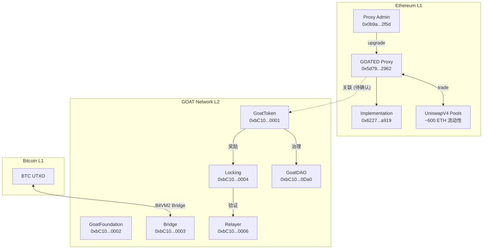

# Token Security Assessment

## 1. 审计摘要

- **项目**: `Goat Network (GOATED)`
- **合约地址**: `0x5d7909f951436d4e6974d841316057df3a622962`
- **链**: Ethereum Mainnet
- **评分**: 73/100 (A)
- **部署时间**: TODO（待确认）
- **审计时间**: 2026-03-14

### 关键发现

| 编号 | 等级 | 发现 |
| --- | --- | --- |
| HIGH-1 | 🔴 HIGH | EIP-1967 Transparent Proxy，Admin 可无 Timelock 升级实现合约 |
| MED-1 | 🟡 MEDIUM | Top 10 持仓集中度 98.35%，Top 3 占 65.20% |
| MED-2 | 🟡 MEDIUM | LP 未锁定，单一合约持有 100% 流动性 |
| MED-3 | 🟡 MEDIUM | L1 实现合约源码未在 GitHub 仓库中提供 |
| LOW-1 | 🔵 LOW | 仅 53 个持有者，极早期分发 |
| LOW-2 | 🔵 LOW | Proxy Admin 无 Timelock 延迟 |
| INFO-1 | ℹ️ INFO | Hacken 第三方审计（2024年10月） |
| INFO-2 | ℹ️ INFO | GoPlus 部分安全字段缺失 |

### 安全亮点

- GoPlus 未检测到蜜罐、买卖税为 0%，无恶意标记
- L2 合约代码质量优秀，基于 OpenZeppelin 最新版，Solidity 0.8.28
- GoatToken (L2) 固定供应、无 mint 函数、支持 ERC20Votes 治理投票
- 存在完整的 L2 安全架构：RateLimiter 防 DoS、RelayerGuard 权限控制、ConsensusGuard 共识层校验
- 第三方 Hacken 安全审计已完成（2024年10月）
- 项目有完整技术文档：BitVM2 白皮书、经济论文、安全模型文档

### 主要风险

- 代理合约升级权限过于集中，无 Timelock/Multisig 保护
- 极高持仓集中度，早期抛压风险显著
- L1 与 L2 合约关系不透明，实现合约未独立验证

---

## 2. 项目概述

| 维度 | 内容 |
| --- | --- |
| 项目名称 | Goat Network |
| Token 符号 | GOATED |
| 合约地址 | 0x5d7909f951436d4e6974d841316057df3a622962 |
| 链 | Ethereum Mainnet |
| GitHub | https://github.com/GOATNetwork/goat-contracts |
| 官网 | https://www.goat.network/ |
| 文档 | https://docs.goat.network/ |
| Token 标准 | ERC-20 (behind EIP-1967 Transparent Proxy) |
| 总供应量 | 7,494,985.443403 GOATED |

GOAT Network 是首个基于 BitVM2 的 Bitcoin ZK Rollup L2。项目核心特点：
- **Trust-Minimized Bridge**: 采用 BitVM2 实现 1-of-n 诚实假设的信任最小化桥接
- **Decentralized Sequencing**: 去中心化排序器，无单点故障
- **Native BTC Yield**: 通过链上经济活动产生真实、可持续的 BTC 收益
- **Universal Operator Model**: 统一参与者角色，通过 epoch 轮换实现激励对齐
- **Ziren zkVM**: 采用 Ziren 零知识虚拟机生成有效性证明

## 3. 生态架构与资金流向



## 4. 合约/程序安全评估

> AI 代码审查结论。基于源码分析、扫描器交叉验证、设计模式识别。

### 4.1 合约概览

**L1 合约（已部署）**:
- 合约类型: EIP-1967 Transparent Proxy
- 代码大小: 1,663 bytes（典型代理合约尺寸）
- Implementation: `0x6227907d94ebe5e9710218ddd07d303c9195a919`
- Admin: `0x0b9a9ac2f546aa2c328f7ccdc8fd7518945d2f5d`
- 实现合约 Owner: `0x01663c7f4bd52da2c00ea6fbb55a004b2aa3a43d`

**L2 合约（GitHub 仓库）**:
- 框架: Hardhat + OpenZeppelin Contracts
- Solidity 版本: 0.8.28 (固定版本，编译器安全)
- 合约数量: 24 个 Solidity 文件
- 预部署合约: 8 个核心系统合约
- 许可证: Apache 2.0

### 4.2 设计模式与继承关系

**GoatToken**:
```
GoatToken → ERC20 + ERC20Burnable + ERC20Permit + ERC20Votes + Nonces
```
- 标准 OpenZeppelin ERC20 全功能实现
- ERC20Votes 支持链上治理投票
- ERC20Permit 支持 gasless approval (EIP-2612)
- ERC20Burnable 支持代币销毁

**GoatFoundation**:
```
GoatFoundation → Ownable + IERC165 + IGoatFoundation
```
- Owner 可转账 ETH 和 ERC20
- `invoke()` 函数可调用任意合约（排除 owner 地址防重入）

**Bridge**:
```
Bridge → Ownable + RelayerGuard + RateLimiter + IBridge + IBridgeParam + IERC165
```
- 存/取款由 Relayer 共识层控制
- RateLimiter 防 DoS（每区块 32 次请求上限）
- 取款金额通过 Burner 合约销毁

**Locking**:
```
Locking → Ownable + RateLimiter + ILocking
```
- 验证者 PoS 入口
- 支持多 token 质押
- ConsensusGuard 确保仅共识层可调用敏感函数

**GoatDAO**:
```
GoatDAO → Governor + GovernorSettings + GovernorCountingSimple + GovernorVotes + GovernorVotesQuorumFraction
```
- 标准 OpenZeppelin Governor
- 投票延迟: 1 天，投票期: 1 周，法定人数: 4%

### 4.3 核心函数分析

| 函数 | 访问控制 | 风险等级 | AI 评估 |
| --- | --- | --- | --- |
| GoatToken.constructor | 内部 | LOW | 固定铸造 1B 给 owner，无后续 mint |
| GoatFoundation.transfer | onlyOwner | MEDIUM | Owner 可转移 Foundation 的 ETH |
| GoatFoundation.invoke | onlyOwner | MEDIUM | Owner 可调用任意合约（排除自身防重入） |
| Bridge.deposit | OnlyRelayer | LOW | 仅共识层 Relayer 可执行存款 |
| Bridge.withdraw | RateLimiting (public) | LOW | 用户自主发起，有速率限制和金额检查 |
| Bridge.paid | OnlyRelayer | LOW | Relayer 完成取款，通过 Burner 销毁金额 |
| Bridge.setWithdrawalTax | onlyOwner | MEDIUM | Owner 可修改取款税率（上限 1%） |
| Locking.create | public + RateLimiting | LOW | 需 ECDSA 签名验证 + 审批 |
| Locking.distributeReward | ConsensusGuard | LOW | 仅共识层可调用 |
| Locking.grant | onlyOwner | MEDIUM | Owner 可向奖励池添加 GOAT |
| Relayer.addVoter | onlyOwner | MEDIUM | Owner 管理 Relayer 投票者 |

### 4.4 Owner 特权函数

**L1 Proxy Admin 权限**:
- 升级代理实现合约至任意地址（无 Timelock）
- 更改代理 Admin 地址

**L2 合约 Owner 权限 (GoatFoundation)**:
- 转移 Foundation 持有的 ETH 和 ERC20
- 调用任意外部合约 (`invoke`)

**L2 合约 Owner 权限 (Bridge)**:
- 修改存款/取款税率 (`setDepositTax`, `setWithdrawalTax`)
- 修改最低存/取款金额 (`setMinDeposit`, `setMinWithdrawal`)
- 修改确认数 (`setConfirmationNumber`)

**L2 合约 Owner 权限 (Locking)**:
- 添加/修改质押 Token 配置 (`addToken`, `setTokenWeight`, `setTokenLimit`)
- 修改验证者创建阈值 (`setThreshold`)
- 开启奖励领取 (`openClaim`)
- 向奖励池注入 GOAT (`grant`)
- 审批验证者 (`approve`)

**L2 合约 Owner 权限 (Relayer)**:
- 添加/移除 Relayer 投票者 (`addVoter`, `removeVoter`)

## 5. 静态分析结果

> AI 对 Pattern Scanner High/Medium 发现的误报研判。

| 编号 | 检测器 | 位置 | AI 研判 | 理由 | 实际风险 |
| --- | --- | --- | --- | --- | --- |
| PS-1 | 缺少权限控制: withdraw | Bridge.sol:112 | **误报** | `withdraw` 是用户自主发起的取款函数，设计上对所有人开放，有 `RateLimiting` 修饰符 | N/A |
| PS-2 | 缺少权限控制: setWithdrawalTax | Bridge.sol:309 | **误报** | 函数签名包含 `onlyOwner` 修饰符，扫描器未正确识别 | N/A |
| PS-3 | 缺少权限控制: setDepositTax | Bridge.sol:323 | **误报** | 同上，有 `onlyOwner` | N/A |
| PS-4 | 缺少权限控制: setMinWithdrawal | Bridge.sol:344 | **误报** | 同上，有 `onlyOwner` | N/A |
| PS-5 | 缺少权限控制: setMinDeposit | Bridge.sol:355 | **误报** | 同上，有 `onlyOwner` | N/A |
| PS-6 | selfdestruct 使用 | Burner.sol:6 | **真阳性** | Burner 使用 `selfdestruct` 销毁 BTC。但这是设计意图：创建合约并立即自毁以销毁 native token。EIP-6780 后 selfdestruct 仅在创建交易中有效。 | LOW |
| PS-7 | 重入攻击风险: reclaim | Locking.sol:327 | **误报** | `unclaimed[msg.sender] = 0` 在 `safeTransfer` 之前执行，遵循 CEI 模式。状态在外部调用前已更新。 | N/A |
| PS-8 | 缺少权限控制: setTokenWeight | Locking.sol:412 | **误报** | 有 `onlyOwner` 修饰符 | N/A |
| PS-9 | 缺少权限控制: setTokenLimit | Locking.sol:452 | **误报** | 有 `onlyOwner` 修饰符 | N/A |
| PS-10 | 缺少权限控制: setThreshold | Locking.sol:466 | **误报** | 有 `onlyOwner` 修饰符 | N/A |

**扫描器结果汇总**: 10 个 HIGH 发现中，9 个为误报，1 个为真阳性但实际风险为 LOW。

## 6. GoPlus 安全检测结果

| 检查项 | GoPlus 结果 | 判定 | 风险等级 |
| --- | --- | --- | --- |
| 蜜罐 (is_honeypot) | 未返回 | N/A | - |
| 可增发 (is_mintable) | 未返回 | N/A | - |
| 代理/可升级 (is_proxy) | 1 | **FAIL** | HIGH |
| 暂停转账 (transfer_pausable) | 未返回 | N/A | - |
| 黑名单 (is_blacklisted) | 未返回 | N/A | - |
| 隐藏 Owner (hidden_owner) | 未返回 | N/A | - |
| 自毁 (selfdestruct) | 未返回 | N/A | - |
| 外部调用 (external_call) | 未返回 | N/A | - |
| 可夺回所有权 (can_take_back_ownership) | 未返回 | N/A | - |
| Owner 可改余额 (owner_change_balance) | 未返回 | N/A | - |
| 源码已验证 (is_open_source) | 1 | PASS | INFO |
| 无法买入 (cannot_buy) | 0 | PASS | INFO |
| 无法全部卖出 (cannot_sell_all) | 未返回 | N/A | - |
| 滑点可修改 (slippage_modifiable) | 未返回 | N/A | - |
| 创建者蜜罐记录 (honeypot_with_same_creator) | 0 | PASS | INFO |
| 已上 DEX (is_in_dex) | 1 | PASS | INFO |
| 买入税 (buy_tax) | 0% | PASS | INFO |
| 卖出税 (sell_tax) | 0% | PASS | INFO |

**注意**: GoPlus API 仅返回了部分安全检测字段。17 项标准检查中有 11 项未返回（N/A），可能因为代理合约的分析复杂度较高或合约较新。已返回的 6 项检查均为 PASS（除 is_proxy 外）。

## 7. 链上数据分析

### 7.1 RPC 直读数据

| 字段 | 值 | 说明 |
| --- | --- | --- |
| name | Goat Network | ERC20 name() |
| symbol | GOATED | ERC20 symbol() |
| decimals | 18 | 标准精度 |
| totalSupply | 7,494,985.443403 | 远低于 L2 构造函数的 1,000,000,000 |
| owner() | 0x0166...a43d | 实现合约的 owner |
| Code Size | 1,663 bytes | 典型代理合约大小 |
| Proxy Admin | 0x0b9a...2f5d | EIP-1967 admin slot |
| Implementation | 0x6227...a919 | EIP-1967 implementation slot |

### 7.2 GoPlus 交叉验证

| 数据点 | GoPlus | RPC | 一致性 |
| --- | --- | --- | --- |
| Token Name | Goat Network | Goat Network | ✅ 一致 |
| Symbol | GOATED | GOATED | ✅ 一致 |
| Total Supply | 7,494,985.443403 | 7,494,985.443403 | ✅ 一致 |
| Owner | 0x0b9a...2f5d | 0x0166...a43d | ⚠️ 不一致 |
| Is Proxy | 1 (是) | 是 (EIP-1967) | ✅ 一致 |

**Owner 差异分析**: GoPlus 返回的 owner (`0x0b9a...2f5d`) 实际是 EIP-1967 Proxy Admin，而 RPC 直读的 owner() (`0x0166...a43d`) 是实现合约暴露的 `owner()` 函数返回值。这两个地址代表不同层级的控制权：
- Proxy Admin 可升级整个合约实现（最高权限）
- Implementation Owner 控制实现合约内的 owner-restricted 函数

## 8. 代币经济模型分析

| 维度 | 内容 |
| --- | --- |
| 总供应量 | 7,494,985.443403 GOATED (L1) |
| L2 构造函数铸造量 | 1,000,000,000 GOATED |
| 持有者数 | 53 |
| Top 10 集中度 | 98.35% |
| 买入税 | 0% |
| 卖出税 | 0% |

**供应量差异分析**:
- L2 GoatToken 构造函数铸造 1,000,000,000 GOATED
- L1 合约当前总供应量仅 7,494,985 GOATED（约 0.75%）
- 差额可能原因：大部分 GOATED 仍在 L2 网络上；L1 仅流通跨链桥出的部分
- 另一种可能：L1 合约并非 L2 GoatToken 的直接映射，而是独立发行

**持仓分布特征**:
- 极度集中：前 3 名持有 65.20%，前 10 名持有 98.35%
- 所有 Top 10 均为 EOA（非合约），无锁定
- 创建者余额为 0，表明项目方未通过创建者地址持有代币
- 53 个总持有者表明项目处于极早期

**流动性特征**:
- 5 个 UniswapV4 池，总流动性约 600 ETH
- 主池流动性约 297 ETH
- 对于 7.5M token 供应量，流动性相对充足

## 9. 治理架构分析

**L2 治理（GoatDAO）**:
- 基于 OpenZeppelin Governor 的标准治理架构
- 投票代币: GoatToken (ERC20Votes)
- 投票延迟: 1 天
- 投票期: 1 周
- 法定人数: 4% 的投票代币
- 提案阈值: 0（任何人可提案）

**L1 治理**:
- Proxy Admin (0x0b9a...2f5d) 为 EOA 或合约（待确认）
- 无检测到 Timelock 或 Multisig
- 升级操作可即时执行

**L2 共识治理**:
- CometBFT 共识算法，容忍 1/3 拜占庭节点
- Relayer 操作需 2/3 阈值批准
- BLS 聚合签名确保高效多方签名
- RANDAO 轮换确保排序器公平选举

## 10. 桥/Vault/跨链风险

**GOAT BitVM2 Bridge**:
- 基于 BitVM2 的信任最小化桥接，1-of-n 诚实假设
- 存款（Peg-In）: 用户锁定 BTC → 收到 PegBTC (L2)
- 取款（Peg-Out）: 原子交换 + 运营者预付 → 挑战期 → 报销
- 运营者质押在 L2 上，通过削减机制惩罚恶意行为

**桥接安全机制**:
- Watchtower 监控 Bitcoin 链并提交证明
- 挑战者可质疑恶意运营者
- 运营者失败时质押被削减
- 退出保证: 1-of-n 诚实假设确保用户资金安全

**跨链风险评估**:
- Bridge.sol 的 `deposit()` 和 `paid()` 仅 Relayer 可调用，有共识层保护
- `withdraw()` 有 RateLimiter 和金额验证
- 取款税率可由 Owner 修改（最大 1%），但有 checkTax 限制

## 11. 第三方依赖风险

| 依赖 | 版本/来源 | 风险评估 |
| --- | --- | --- |
| OpenZeppelin Contracts | 最新版（0.8.28 兼容） | 低风险 — 行业标准审计库 |
| Hardhat | 开发框架 | 低风险 — 仅开发工具 |
| EIP-1967 Proxy | 标准代理模式 | 中风险 — 升级权限集中 |
| CometBFT | 共识引擎 | 低风险 — 成熟的 BFT 引擎 |
| BitVM2 | 桥接协议 | 中风险 — 较新技术，但有白皮书和形式化验证 |

**第三方审计**:
- Hacken: "Hacken_GOAT_Network_SCA_GOAT_Network_GOAT_Contracts_Oct2024_P_2024.pdf"
- 另一份审计报告: "GOAT Network Audit Report.pdf"

## 12. 风险矩阵

| 风险项 | 可能性 | 严重程度 | 综合风险 |
| --- | --- | --- | --- |
| Proxy 恶意升级 | 低 (正规项目) | 极高 (可改任意逻辑) | 🟡 MEDIUM |
| 大户集中抛售 | 中 (98.35% 集中) | 高 (价格崩溃) | 🟡 MEDIUM |
| LP 流动性撤离 | 低 (未锁定但集中) | 高 (无法交易) | 🟡 MEDIUM |
| GoPlus 未检测的隐藏风险 | 低 | 未知 | ⚪ 待确认 |
| L1 实现合约漏洞 | 低 (已审计) | 高 | 🟢 LOW |
| L2 Bridge 攻击 | 极低 (BitVM2 + 多层防护) | 极高 | 🟢 LOW |
| 治理攻击 (GoatDAO) | 极低 (4% 法定人数) | 中 | 🟢 LOW |

## 13. 建议与缓解措施

1. **Proxy Admin 升级治理**: 建议将 Proxy Admin 迁移至 Timelock + Multisig 合约，设置最低 48 小时延迟，确保社区可审查升级内容
2. **L1 实现合约透明度**: 建议在 GitHub 仓库中提供 L1 代理合约和实现合约的源码，或在 Etherscan 上验证实现合约代码
3. **代币分发**: 建议公开 GOATED 代币的完整分配计划（团队、基金会、生态、投资者比例及解锁时间表）
4. **LP 锁定**: 建议将主要 LP 头寸锁定至少 6 个月，降低流动性撤离风险
5. **持仓监控**: 鉴于极高集中度，建议建立大额转账监控机制，及时预警潜在抛压
6. **GoPlus 覆盖**: 建议待 GoPlus 完善对该代理合约的分析后重新检测，补全缺失的安全字段
7. **Owner 权限文档**: 建议项目方公开 Proxy Admin 和 Implementation Owner 的身份或治理架构说明
